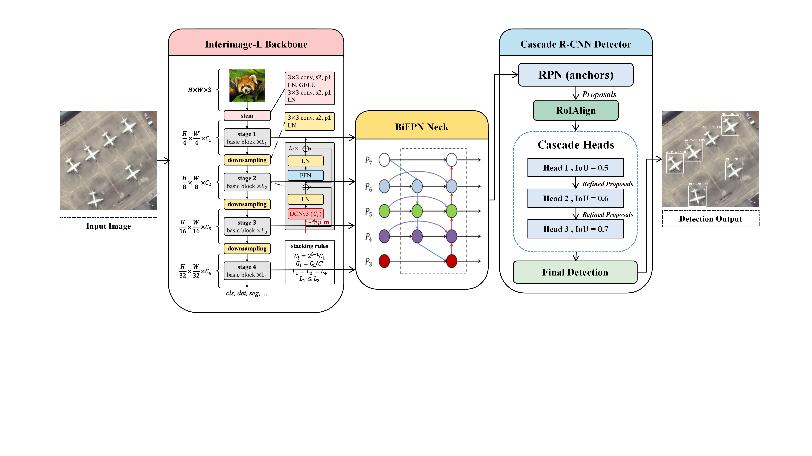
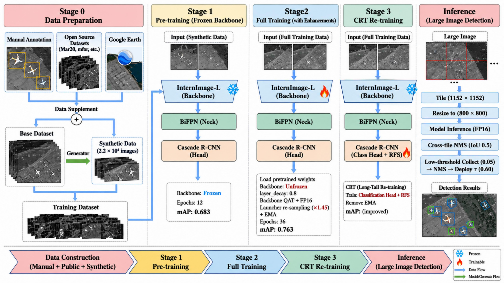

<div align="center">

# Remote Sensing Detection

### InternImage-L · BiFPN · Cascade R-CNN · cRT

An end-to-end detector for small objects, large scenes, and long-tailed
categories in remote-sensing imagery.

<p>
  <a href="https://github.com/asdf12221/remote-dectection-mode"></a>
  
  
  
  
</p>

<p>
  <a href="#overview">Overview</a> ·
  <a href="#pipeline">Pipeline</a> ·
  <a href="#validation-results">Results</a> ·
  <a href="#quick-start">Quick start</a> ·
  <a href="#project-layout">Layout</a>
</p>

</div>

<p align="center">
  
</p>
<p align="center"><em>Final detector architecture: InternImage-L backbone, BiFPN neck, Cascade R-CNN head, and cRT classifier adaptation.</em></p>

## Overview

This repository packages the final remote-sensing detection pipeline as a
source-only project. It supports 25 classes: four ship categories, twenty
aircraft categories, and FSC (launch vehicle).

| Component | Role |
| --- | --- |
| **InternImage-L** | Multi-scale visual representation with deformable convolutions. |
| **BiFPN** | Bidirectional feature fusion for objects at different scales. |
| **Cascade R-CNN** | Progressive box refinement through three detection stages. |
| **cRT** | Classifier re-training for long-tailed category balance. |
| **Tiled inference** | Large-scene prediction with coordinate remapping and global NMS. |

Synthetic pretraining data comes from the companion generation project
[**FPBA-Syn**](https://github.com/asdf12221/FPBA-Syn). This repository contains
the detector code, configs, custom operators, and entry points; datasets and
large checkpoints are kept external.

## Competition result

🏆 In the preliminary round of **Challenge Cup XH-202625**, our project achieved
 a result within the **top 20%** of participating teams.

## Pipeline

<p align="center">
  
</p>

```text
01  synthetic pretraining
        ↓
02  train-only fine-tuning
        ↓
03  cRT classifier re-training (fc_cls only)
        ↓
04  validation and large-image inference
```

The public benchmark uses a train-only A0 split for optimization and the
`finaldatav5` validation split for evaluation. Validation images are not used
for gradient updates.

## Validation results

The headline numbers below are from the train-only A0 protocol:

| Model | mAP | AP50 | AP75 |
| --- | ---: | ---: | ---: |
| InternImage-L + BiFPN + Cascade R-CNN | 0.759 | 0.946 | 0.908 |
| **+ cRT** | **0.758** | **0.944** | **0.909** |

At confidence threshold **0.70** and same-class matching IoU **0.50**:

| Precision | Recall | F1 | Miss rate | False-alarm rate |
| ---: | ---: | ---: | ---: | ---: |
| **94.91%** | **95.06%** | **94.98%** | **4.94%** | **5.09%** |

### cRT operating-point effect

| Metric @ score 0.70 | pre-cRT | cRT | Change |
| --- | ---: | ---: | ---: |
| Miss rate (MR) | 4.29% | 4.94% | +0.66 pp |
| False-alarm rate (FAR) | 6.44% | **5.09%** | **−1.35 pp (−21.02%)** |

At this operating point, cRT reduces false alarms and improves precision/F1,
with a small increase in miss rate. The reported validation split is also used
for checkpoint selection, so these numbers should be read as a validation-set
model-selection result rather than an untouched test estimate.

## Quick start

### 1. Install dependencies and build DCNv3

Use a CUDA-compatible PyTorch environment, then install the detector
dependencies and compile the custom operator:

```bash
pip install -r requirements.txt
cd ops_dcnv3
python setup.py build_ext --inplace
cd ..
```

### 2. Set local paths

```bash
export FPBA_DATA_ROOT=/data/finaldatav5
export FPBA_TRAIN_ONLY_ROOT=/data/train_only
export FPBA_TRAIN_ONLY_ANN=annotations_train_abl.json
export FPBA_INTERNIMAGE_CKPT=/models/internimage_l_22k_192to384.pth
export FPBA_SYNTH_CKPT=/models/synth_pretrain_epoch12.pth
export FPBA_WORK_ROOT=$PWD/work_dirs
```

Datasets and `.pth` files are intentionally not committed. See
[`weights/README.md`](weights/README.md) for expected checkpoint names.

<details>
<summary><b>Train the public three-stage pipeline</b></summary>

Run from the repository root:

```bash
bash scripts/train_synthetic.sh
bash scripts/train_finetune.sh
bash scripts/train_crt.sh
```

To override a checkpoint explicitly:

```bash
S1_CKPT=/models/synth_pretrain_epoch12.pth \
  bash scripts/train_finetune.sh

FT_CKPT=/models/a0_best_epoch35.pth \
  bash scripts/train_crt.sh
```

</details>

<details>
<summary><b>Evaluate on the validation split</b></summary>

```bash
python scripts/evaluate.py \
  --config configs/cascade_merged_25cls_v3_ce_v5_bifpn_v5_fp16_finaltrain_abl_a0_crt_config.py \
  --ckpt /models/a0_crt_best.pth \
  --val-json /data/finaldatav5/annotations_val.json \
  --image-root /data/finaldatav5/images/all \
  --output eval_results.json
```

The evaluator reports COCO AP plus miss-rate and false-alarm-rate summaries at
the configured confidence thresholds.

</details>

<details>
<summary><b>Run inference</b></summary>

Single image:

```bash
python scripts/infer_single.py \
  --image image.png \
  --config configs/cascade_merged_25cls_v3_ce_v5_bifpn_v5_fp16_finaltrain_abl_a0_crt_config.py \
  --ckpt /models/a0_crt_best.pth
```

For large scenes, `infer_large.py` tiles images at 1152×1152 with 152-pixel
overlap, resizes tiles to 800×800, maps boxes to global coordinates, and
applies same-class global NMS.

</details>

## Project layout

```text
configs/       MMDetection config chain for synthetic pretraining, fine-tuning and cRT
scripts/       training, evaluation and single/large-image inference entry points
mmdet_custom/  InternImage, BiFPN, cRT and sampling components
ops_dcnv3/     source and build files for the custom DCNv3 operator
weights/       checkpoint placement and download notes
assets/        public architecture and training-pipeline figures
```

## Reproducibility notes

- The public result uses the train-only A0 split and `finaldatav5` validation split.
- cRT re-trains only the Cascade R-CNN classifier layers; backbone, neck, RPN
  and regression branches remain frozen.
- The synthetic initialization is generated by [FPBA-Syn](https://github.com/asdf12221/FPBA-Syn).
- Large datasets, checkpoints and generated outputs are intentionally excluded.

## License and attribution

This repository contains adapted InternImage and DCNv3 components. Preserve
upstream licenses and attribution notices when redistributing. Third-party
datasets and pretrained weights remain subject to their own licenses. Review
those terms before publishing a derived model or dataset.
